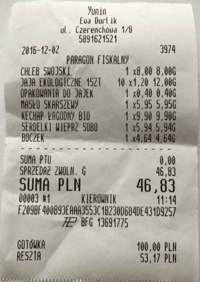

## Mocks, stubs and spies

Jak obsługiwać rachunki takie jak niżej, ale z produktami o cenach w różnych
walutach.



```
bin/
├── console
spec/
├── integration
│   ├── exchange_money_spec.rb
│   └── report_spec.rb
├── spec_helper.rb
└── unit
    ├── money_spec.rb
    └── product_spec.rb
    └── order_spec.rb

bundle exec rspec
```

The purpose of the _*bin/console*_ script is to make experimenting
with this project easier. The script is a customization of
the script with the same name from the generated gem scaffold project:
```sh
bundle gem wallet
```

----

The _exchange_rate_2016-12-02.csv_ file contains data used in some tests.

| Currency | Exchange Rate |
| -------- | -------------:|
| EUR      | 4.50          |
| PLN      | 1.00          |
| USD      | 4.22          |


### Explore classes in _bin/console_

First check if unit test are working.
```sh
bundle exec rspec -fd spec/unit
# bundle exec rspec -fd spec/integration
```
Next run
```sh
bin/console
```

### Experimenting with _Money_

```ruby
pl = Money.new 10, 'PLN'
us = Money.new 10, 'USD'
```

```ruby
ls # Pry

pl.value
pl.currency
us.currency

pl.to_s
pl * 5
pl + pl

show-source Money # Pry

Money.sum [pl, pl*4, pl]
Money.sum [pl*2, us, us*4, pl]
```


### Experimenting with _Product_

```ruby
pln1 = Money.new 1.00, 'PLN'

pl1 = Product.new 'chleb swojski', pln1 * 8
pl2 = Product.new 'jaja eko', pln1 * 12
pl3 = Product.new 'kechap łagodny', pln1 * 9.90

us1 = Product.new 'butter eco', Money.new(2, 'EUR')
us2 = Product.new 'sausages', Money.new(4, 'EUR')
```


### Experimenting with _Order_

```ruby
opl = Order.new 'Yunin', '2016-12-02', [pl1, pl2]
opl.add pl3
ous = Order.new 'Yunin', '2016-12-02', [us1, us2]

order = Order.new 'Biedronka', '2016-12-02', [us1, pl1, pl3, us2]
Order.sum order.monies
```


## Unit tests

* _money_spec.rb_ – `let`, `subject`
* _order_spec.rb_ – more examples of `let` and `subject`
* _product.rb_ – ensure isolation


## TODO

* _Exchange_
* _Report_


## FAQ

1\. _require_ 'something' does not work.

Check `LOAD_PATH` on the command line:
```sh
ruby -e 'puts $LOAD_PATH'
```
or in _irb_:
```ruby
puts $LOAD_PATH
```
